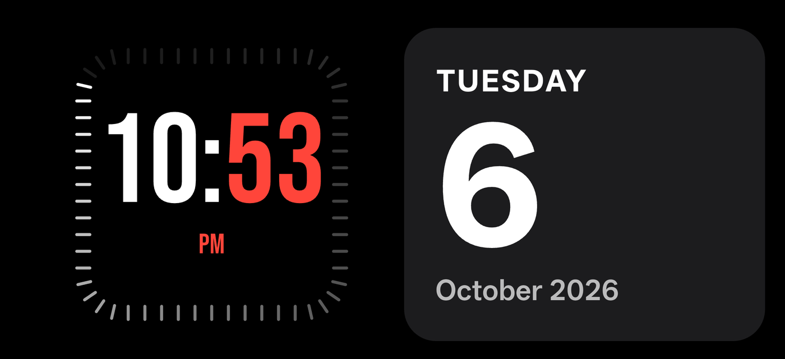
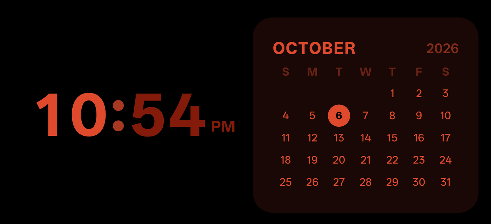
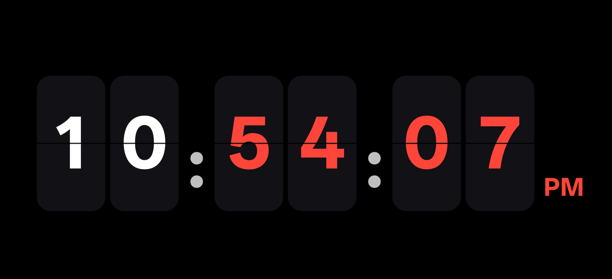
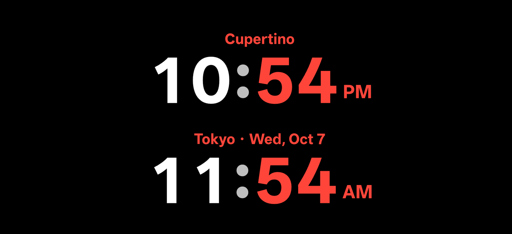
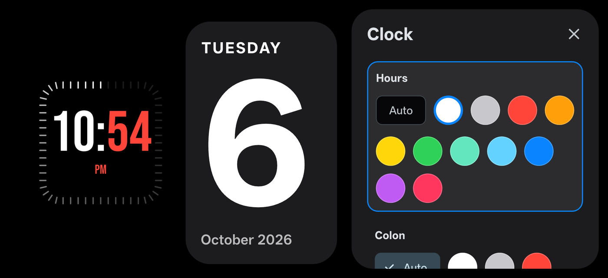
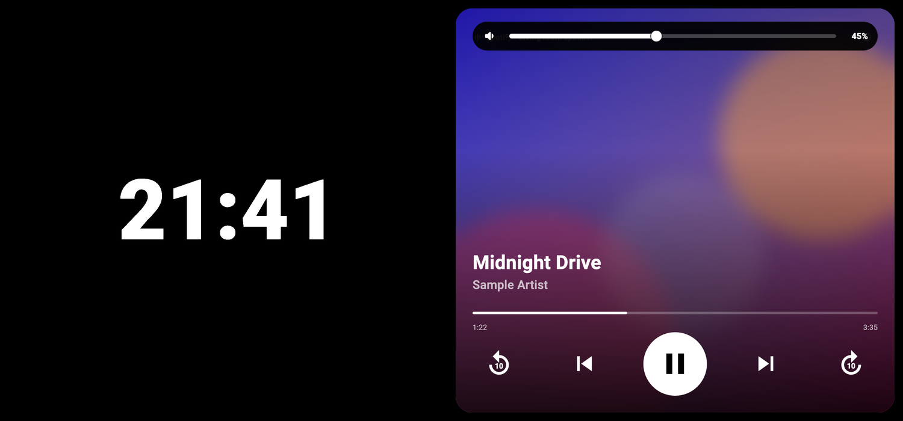
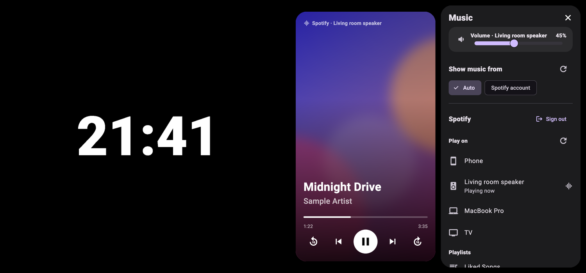
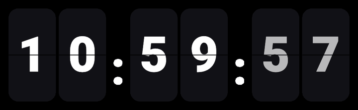
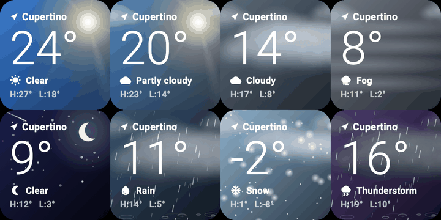
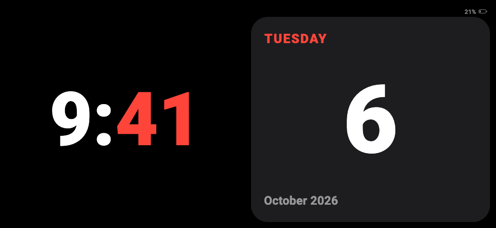

# Dockwise

[](LICENSE)
[](#platforms)
[](#)

Dockwise turns a charging phone into a bedside display: big readable clocks, live weather, a calendar and a Spotify now-playing card, designed for a dark room. It is built with Flutter for Android and iPhone, and is based on the open-source Standby Pro project.

The look is inspired by iOS StandBy, but the layouts, themes, controls and motion are original.

<p align="center">
  
  
</p>
<p align="center">
  
  
</p>
<p align="center">
  
</p>

*Screenshots are from an Android phone. Cities shown are placeholders.*

## Spotify and music

Tap the speaker icon on the music card to open the volume bar for the device that is playing (a speaker, a Mac, the phone...). It closes by itself after a few seconds.

<p align="center">
  
</p>

Music settings: volume of the playing device, which player the card follows, sign in and out of Spotify, the device to play on, and your playlists.

<p align="center">
  
</p>

*These two images are rendered from the app's own music widgets with a sample song and generic device names, so no personal Spotify details are shown.*

## Features

**Clocks**
- Styles: digital, analog, frame (condensed digits inside a fading ring of 60 ticks), flip (one card per digit, with a seconds card), mono, float, text and world clock.
- Color per part (hours, minutes, colon, label, ticks), ready-made presets such as "Red & white" and "Night red", and an app accent that is separate from the clock look.
- World clock with worldwide city search and an on-screen keyboard. If the second city is on another date, its label shows the day and date.
- 12/24-hour time, optional seconds, adjustable size, no per-second layout jumps.

**Cards**
- **Weather:** animated Apple-style scenes (sun, clouds, rain, snow, fog, storm, night sky) from your phone's location.
- **Calendar:** today or the whole month.
- **Music:** now playing with transport, 10-second skips, hold-the-progress-bar to seek, and Spotify volume.

**Spotify**
- Sign in with Spotify and control playback on any device: a Mac, a speaker, a TV or the phone itself (Spotify Premium is needed for control).
- Pick the playing device, start a playlist, and set the volume of that device from the music card or Music settings.
- Sign out and sign in again with a different account at any time.

**Layout and gestures**
- One or two panels. Pinch with two fingers: spread = one panel (the one you spread on), pinch together = two panels, back in the original order. One-finger swipes change the card.
- Tap any panel to open a settings dock whose changes preview live behind it.

**Night and battery**
- **Night mode:** choose your own hours; colors fade to a dim red, amber or your theme color with no blue light, with an adjustable strength.
- **OLED care:** slow burn-in pixel shifting once a minute, adjustable brightness.
- **Battery badge:** a tiny percentage in the top-right corner, shown only when the battery is not full on the charger (grey on battery, green charging, red when low).
- **Low-battery prompt:** at a level you choose (5-50%, default 20%) and not charging, a full-screen "Charge your phone" prompt appears until you plug in. It can be turned off in settings.

**Auto-start (Android only)**
- Opens Dockwise by itself when the phone is charging and propped up in landscape, and closes it when you unplug. Details below.

## Animations

**Flip clock:** every digit is its own card. The seconds digit flips each second, and a digit only flips when it changes (here: 10:59:57 rolling over to 11:00:02).

<p align="center">
  
</p>

**Weather scenes** (sun, clouds, fog, night sky, rain, snow, storm) and the **low-battery prompt** (battery drops to the alert level, the prompt fades in, then fades out when the charger is plugged in):

<p align="center">
  
  
</p>

*The weather and low-battery animations are rendered from the app's own widgets with sample data and a placeholder city.*

## Platforms

| Feature | Android | iPhone |
|---|---|---|
| All clock styles, themes, presets, layouts, pinch | Yes | Yes |
| Weather, calendar, world clock | Yes | Yes |
| Night mode, burn-in shift, brightness, keep awake | Yes | Yes |
| Spotify account control and volume | Yes | Yes |
| Battery badge and low-battery prompt | Yes | Yes |
| Show and control music from other apps on the phone | Yes | No (iOS does not allow it) |
| Open itself when docked and charging | Yes | No (iOS does not allow it; use the built-in StandBy) |

### Android auto-start

When enabled, a small foreground service watches the charger. While charging, it reads the gravity sensor at a low rate and opens Dockwise once the phone has been propped up (default 40° or more from flat) in landscape for 1.5 seconds. It closes the app 4 seconds after unplugging, but only if it opened itself. To launch from the background it uses "Display over other apps" and a full-screen notification over the lock screen. In the app go to Settings > All settings > Auto-start; a checklist there shows what still needs to be allowed (overlay, notifications, battery set to Unrestricted).

## Permissions

| Platform | Permission | Used for |
|---|---|---|
| Both | Location, only while the app is open | Local weather and your city name |
| Both | Internet | Weather (Open-Meteo, BigDataCloud) and Spotify |
| Android | Notification access (optional) | Reading what other apps are playing |
| Android | Display over other apps, full-screen notifications, foreground service, boot completed, wake lock | Auto-start and keeping the tilt sensor alive while charging |
| iPhone | None beyond location | |

Your location is used only to look up weather and a city name and is not stored anywhere but on your device.

## Getting Started

### 1. Install what you need

The full checklist with versions is in [requirements.txt](requirements.txt). Easiest is to let a script install whatever is missing:

| Your computer | Run | Builds for |
|---|---|---|
| **Mac** | `./scripts/setup_mac.sh` | Android and iPhone |
| **Windows** | `.\scripts\setup_windows.ps1` (in PowerShell) | Android only |

Add `--check` (Mac) or `-Check` (Windows) to only see what is missing without installing anything. Both scripts are safe to run again. They install Flutter, JDK 17 and Android Studio (plus CocoaPods on a Mac), set Flutter up to use JDK 17, accept the Android licenses, run `flutter pub get` and finish with `flutter doctor`.

> The Mac script has been tested. The Windows script follows the same steps but has not been run on a Windows PC yet. If it fails, the manual steps below do the same thing.

**Manual install, if you prefer**
1. Install [Flutter](https://docs.flutter.dev/get-started/install) (3.41 or newer) and make sure `flutter` works in a new terminal.
2. Install JDK 17 and tell Flutter to use it: `flutter config --jdk-dir <path to JDK 17>`.
3. Install [Android Studio](https://developer.android.com/studio), open it once to finish its setup wizard, then run `flutter doctor --android-licenses` and answer `y`.
4. Mac and iPhone only: install Xcode from the App Store, then `brew install cocoapods`.
5. Run `flutter doctor` and fix anything it marks with a cross.

### 2. Get the code

```bash
git clone https://github.com/HardikKotangale/Dockwise.git
cd Dockwise
```

### 3. Connect your phone

- **Android:** Settings > About phone, tap *Build number* 7 times, then Settings > Developer options > turn on *USB debugging*. Plug the phone in and accept the prompt. `flutter devices` should list it.
- **iPhone:** Settings > Privacy & Security > turn on *Developer Mode* and restart. Plug in the iPhone and tap *Trust*. Then open `app/ios/Runner.xcworkspace` in Xcode once, pick your Apple ID under *Signing & Capabilities > Team*, and close Xcode.

An Android emulator from Android Studio also works.

### 4. Run it

```bash
cd app
flutter pub get
flutter devices                       # find your phone's id
flutter run                           # Android (add -d <id> if you have several devices)
flutter run -d <iphone-id> --release  # iPhone
```

Always open `ios/Runner.xcworkspace`, never `Runner.xcodeproj`, or Xcode will say a plugin module was not found.

### 5. First run on the phone

- Allow **location** when asked (weather and your city name). You can say no; the clock still works.
- Optional, Android only: Settings > All settings > **Auto-start** to open Dockwise when you dock the phone. A checklist there shows what still needs to be allowed.
- Tap any panel to change clock style, colors and layout. Pinch with two fingers to switch between one and two panels.

### 6. Spotify (optional)

1. Create an app at <https://developer.spotify.com/dashboard> and add the redirect URI `dockwise://spotify-callback`.
2. Copy `app/lib/src/services/spotify_config.example.dart` to `app/lib/src/services/spotify_config.dart` and paste your Client ID. That file is git-ignored, so your Spotify app is never committed. (The setup scripts create the file for you.)
3. Or pass it at build time: `flutter run --dart-define=SPOTIFY_CLIENT_ID=your_id`.
4. In the app, open the music card's settings and tap **Connect Spotify**. Spotify Premium is needed to control playback.

### 7. Tests

```bash
cd app
flutter test
flutter analyze
cd android && ./gradlew :app:testDebugUnitTest   # tilt-detection unit tests (Windows: gradlew.bat)
```

### Troubleshooting

| Problem | Fix |
|---|---|
| `flutter doctor` shows Android licenses not accepted | `flutter doctor --android-licenses` and answer `y` |
| Gradle fails with "Unsupported class file" or a Java version error | Flutter is using the wrong JDK: `flutter config --jdk-dir <path to JDK 17>` |
| No devices listed | Check the cable and *USB debugging*, accept the prompt on the phone, then `adb kill-server` and try again |
| Xcode: `Module 'flutter_web_auth_2' not found` | Open `ios/Runner.xcworkspace`, not the `.xcodeproj` |
| iPhone says the developer is not trusted | Settings > General > VPN & Device Management > trust your Apple ID |
| iPhone app stops opening after 7 days | A free Apple ID expires after 7 days; run it from Xcode or `flutter run` again |
| Spotify login opens but does not come back | The redirect URI in the Spotify dashboard must be exactly `dockwise://spotify-callback` |
| Spotify says it needs a Client ID | Create `spotify_config.dart` as described above |

## Project Layout

- `app/lib/src/domain`: settings, themes, presets and the data shown on the cards.
- `app/lib/src/core`: pinch gesture, night-mode policy, clock cadence and burn-in policy.
- `app/lib/src/features/standby`: the main screen, settings docks, clock faces, weather scenes, music and battery widgets.
- `app/lib/src/services`: Spotify, weather, city search and the native bridge.
- `app/android/.../standbypro`: auto-start service, posture (tilt) logic, media session bridge.
- `app/ios/Runner`: small Swift bridge for keep-awake and brightness.
- `scripts`: one-command setup for macOS and Windows. `requirements.txt` lists everything the project needs.
- `docs`: screenshots and animations used in this README.

## License

MIT. See [LICENSE](LICENSE).
